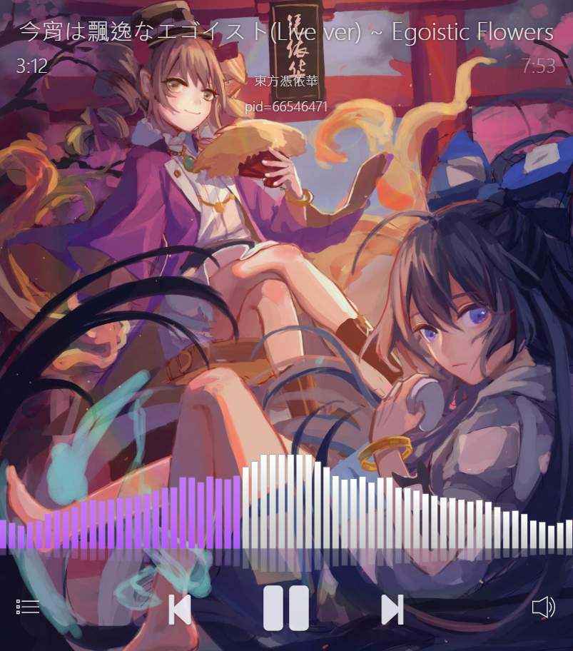
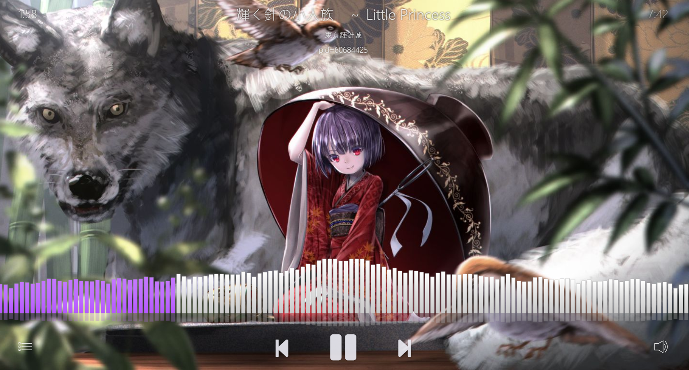
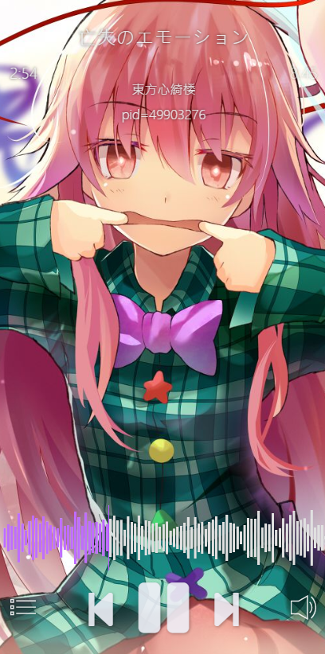
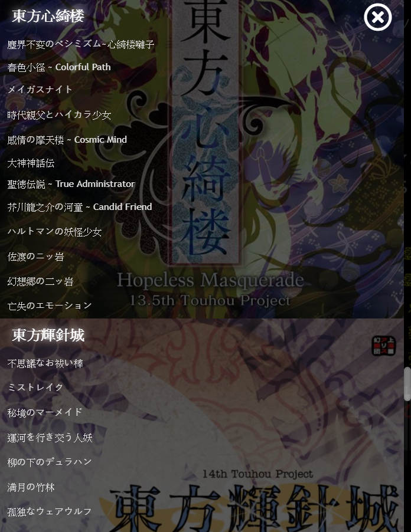
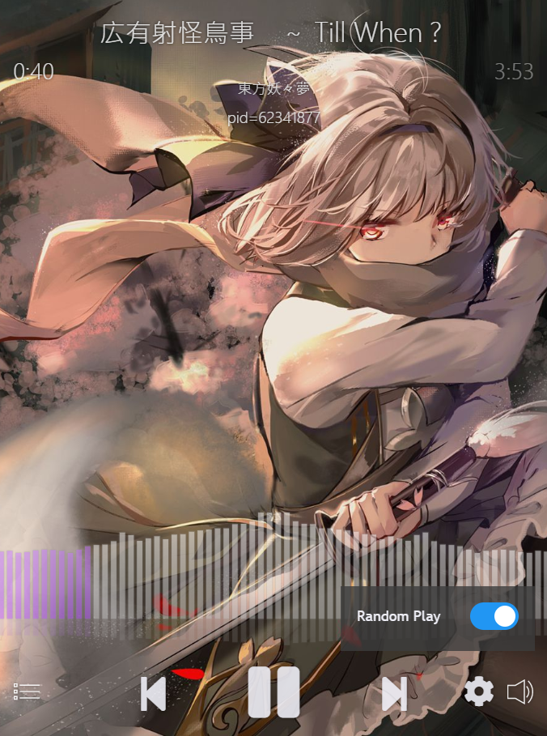
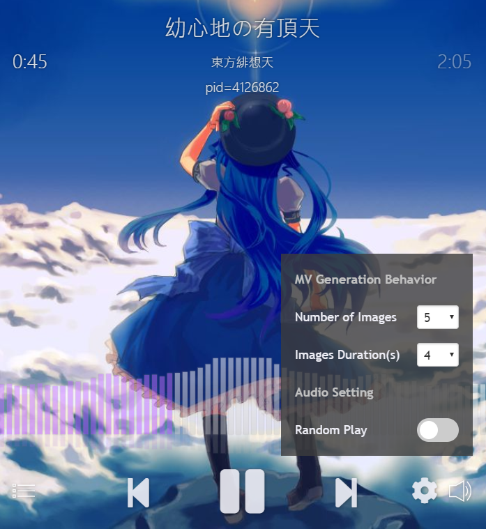
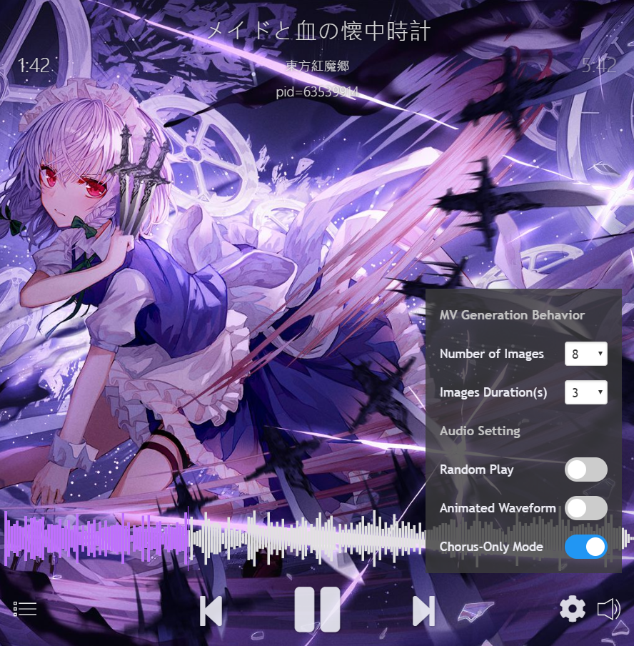

# [Touhou Project Music-Video Generator](https://jasonnor.github.io/th-music-video-generator/)

Touhou Project random music video generator/player, crawling image and video from websites to generate MV. (WIP)

## Feature

+ Random images and video mixture
+ Mobile friendly
+ Highly controllable MV generation options
+ Totally open [json database](https://github.com/Jasonnor/th-music-video-generator/blob/master/database/th-song.json)
+ Full :heart: of Touhou Project!

## Preview

The pid below title is Pixiv ID, and the vid is Youtube ID. You can click them to visit source of image/video! 😉

### Tablet

### Desktop

### Mobile

### Menu

### Video

### Random Play Option

### MV Generation Behavior (New!)

### Chorus-Only Mode & Audio Waveform Option (New!)

## Contributing

The Chorus-Only mode take a lot of time to be done, I need your help. Reply to provide the time of the chorus (It can be the best part you think in the song, because the best melody of Touhou songs may appear in verse instead of chorus), or reply on the [issue page](https://github.com/Jasonnor/th-music-video-generator/issues/16).

Time of the chorus after 東方妖々夢 has not been done. The latest progress can be found [here](https://github.com/Jasonnor/th-music-video-generator/blob/master/database/th-song.json).

Please feel free to [open issues](https://github.com/Jasonnor/th-music-video-generator/issues) or submit [pull requests](https://github.com/Jasonnor/th-music-video-generator/pulls).

We have a known bugs list [here](https://github.com/Jasonnor/th-music-video-generator/issues/5)!

## Reference

+ [上海アリス幻樂団](http://www16.big.or.jp/~zun/)
+ howler.js - [https://howlerjs.com/](https://howlerjs.com/)
+ Plyr - [https://github.com/sampotts/plyr](https://github.com/sampotts/plyr)
+ Firebase - [https://firebase.google.com/](https://firebase.google.com/)
+ Pure - [https://purecss.io/](https://purecss.io/)
+ Font Awesome - [https://fontawesome.com/](https://fontawesome.com/)
+ vudio.js - [https://github.com/margox/vudio.js](https://github.com/margox/vudio.js)
+ wavesurfer.js - [https://wavesurfer-js.org/](https://wavesurfer-js.org/)

## License

Touhou Project Music-Video Generator is released under the Apache License. See the [LICENSE](/LICENSE) file for details.
